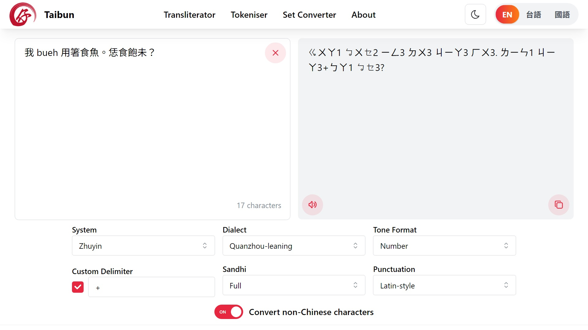
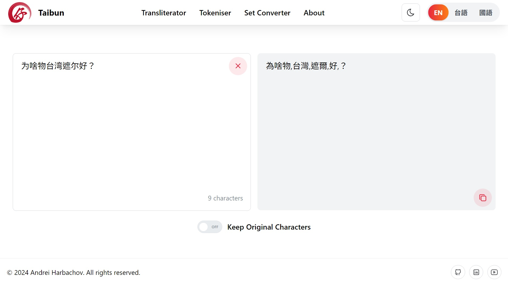
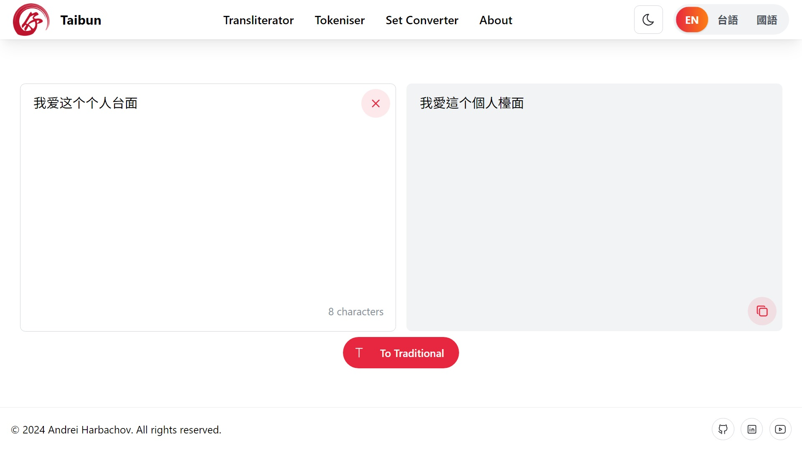
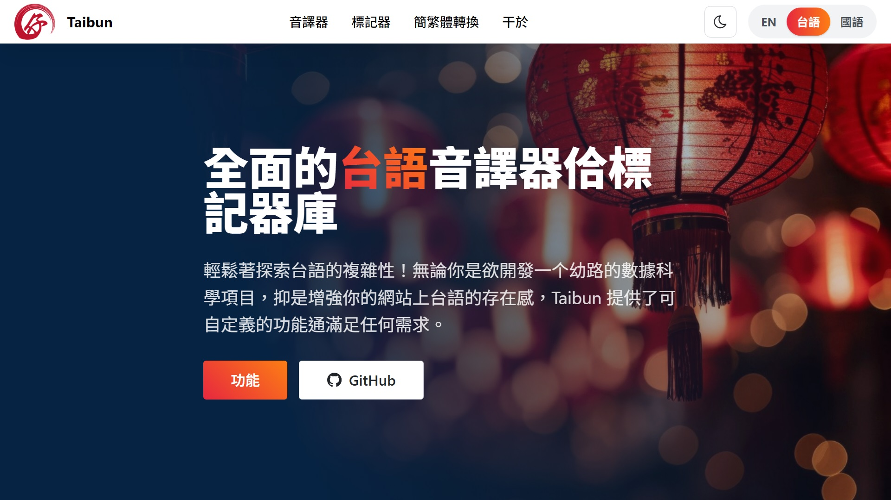
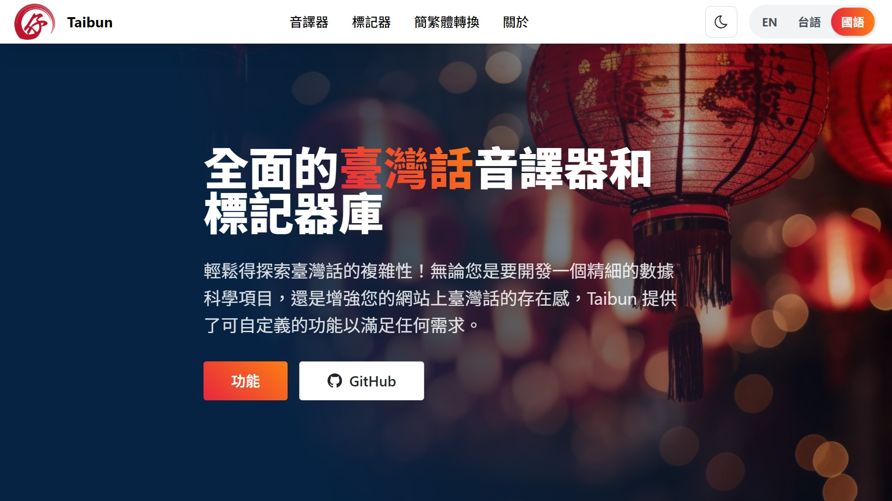
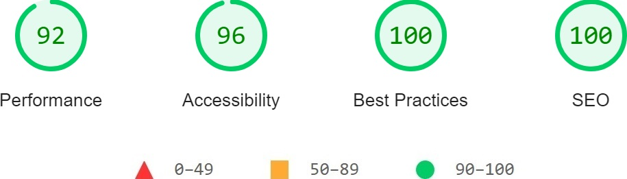

<!-- PROJECT LOGO -->
<div align="center">
  <a href="https://github.com/andreihar/taibun-demo">
    
  </a>
  
# Taibun


<!-- PROJECT SHIELDS -->
[![Contributors][contributors-badge]][contributors]
[![Licence][licence-badge]][licence]
[![LinkedIn][linkedin-badge]][linkedin]

**Taiwanese Hokkien Transliterator and Tokeniser**

App to customise transliteration and retrieve any necessary information about Taiwanese Hokkien pronunciation.

[Live Demo][demo]


</div>


---


<!-- TABLE OF CONTENTS -->
<details open>
  <summary>Table of Contents</summary>
  <ol>
    <li>
      <a href="#about-the-project">About The Project</a>
      <ul>
        <li><a href="#built-with">Built With</a></li>
      </ul>
    </li>
	  <li><a href="#install">Install</a></li>
    <li>
      <a href="#features">Features</a>
      <ul>
		    <li><a href="#transliterator">Transliterator</a></li>
		    <li><a href="#tokeniser">Tokeniser</a></li>
        <li><a href="#set-converter">Set Converter</a></li>
		    <li><a href="#localisation">Localisation</a></li>
      </ul>
    </li>
    <li><a href="#lighthouse-report">Lighthouse Report</a></li>
    <li><a href="#contributors">Contributors</a></li>
    <li><a href="#acknowledgements">Acknowledgements</a></li>
    <li><a href="#licence">Licence</a></li>
  </ol>
</details>


<!-- ABOUT THE PROJECT -->
## About The Project

Taibun is a comprehensive tool for transliterating and tokenising Taiwanese Hokkien. Developed as a demo for the Taibun library, this web application showcases its capabilities by allowing users to customise the transliteration of Chinese characters and retrieve detailed pronunciation information.

The application is designed to streamline the process of transliterating and tokenising Taiwanese Hokkien text, providing users with a user-friendly interface and a variety of customisation options that are supported by Taibun.

### Built With

* [![React][react-badge]][react]
* [![Vite][vite-badge]][vite]
* [![Mantine][mantine-badge]][mantine]
* [![Taibun][taibun-badge]][taibun]


<!-- INSTALL -->
## Install

Run the app locally:

```bash
$ npm install
$ npm run dev
```

The website can be accessed through the URL `http://localhost:5173/`.


<!-- FEATURES -->
## Features

### Transliterator

Transliterator Page allows users to convert Chinese characters to the chosen transliteration system with customisable parameters such as system, dialect, tone format, delimiter, sandhi rules, and punctuation style.

<p align="center">

</p>

### Tokeniser

Tokeniser Page performs tokenisation of Taiwanese Hokkien sentences, breaking down the text into individual words or tokens.

<p align="center">

</p>

### Set Converter

Set Converter Page converts text between Simplified and Traditional Chinese characters for Taiwanese Hokkien.

<p align="center">

</p>

### Localisation

Users can switch between English, Taiwanese, and Mandarin from the language selector in the Navbar.

<p align="center">


</p>


<!-- LIGHTHOUSE -->
## Lighthouse Report

<p align="center">

</p>


<!-- CONTRIBUTORS -->
## Contributors

- Andrei Harbachov ([GitHub][andrei-github] · [LinkedIn][andrei-linkedin])


<!-- ACKNOWLEDGEMENTS -->
## Acknowledgements

- Samuel Jen ([Github][samuel-github] · [LinkedIn][samuel-linkedin]) - Taiwanese and Mandarin localisation


<!-- LICENCE -->
## Licence

Because Taibun is MIT-licensed, any developer can essentially do whatever they want with it as long as they include the original copyright and licence notice in any copies of the source code.


<!-- MARKDOWN LINKS -->
<!-- Badges and their links -->
[contributors-badge]: https://img.shields.io/badge/Contributors-1-44cc11?style=for-the-badge
[contributors]: #contributors
[licence-badge]: https://img.shields.io/github/license/andreihar/taibun-demo.svg?color=000000&style=for-the-badge
[licence]: LICENSE
[linkedin-badge]: https://img.shields.io/badge/LinkedIn-0077B5?style=for-the-badge&logo=linkedin&logoColor=white
[linkedin]: https://www.linkedin.com/in/andreihar/
[react-badge]: https://img.shields.io/badge/React-087EA4?style=for-the-badge&logo=react&logoColor=ffffff
[react]: https://react.dev/
[vite-badge]: https://img.shields.io/badge/Vite-646CFF?style=for-the-badge&logo=vite&logoColor=ffffff
[vite]: https://vitejs.dev
[mantine-badge]: https://img.shields.io/badge/Mantine-339AF0?style=for-the-badge&logo=mantine&logoColor=ffffff
[mantine]: https://mantine.dev/
[taibun-badge]: https://img.shields.io/badge/Taibun-be132d?style=for-the-badge&logo=data:image/png;base64,iVBORw0KGgoAAAANSUhEUgAAAGQAAABZCAMAAAD/2HEVAAAAtFBMVEUAAAD////////////////////////////////////////////////////////////////////////////////////////////////////////////////////////////////////////////////////////////////////////////////////////////////////////////////////////////////////////////oK74hAAAAO3RSTlMA1Pn08MIK7ODoz8jM3LOimZSrZlLYpku9r2PGHvblnDeXgW4SuHcyi2peInIHj1g9LIgVBHxChQ4nGap/ayAAAAhJSURBVGjerJYJc6owFIUTEiTsgqIgBfd9rX22fT3//3+9ElBc0OdbvpnOMB3Mzc05ORfyLF/NSctMIVEM0z10duS/sptEHIDQqMIpNaiumzSrZ7eGL+R/8Ln1GcC5ouu4wBApDQB6+CL/SM8HFE1juINpUQVhk/wDbRNIOC+EsBy3W+979XrdbdW79a6at0ZjG8F8/bdKxDiijX3HobhAof5H3+cAmGEl+vBvyiwdKAoymO+OOQpsQ4ggoBaDRHe9LgdAVWYvyB9S2ytHfV0nXzAVqWGLU28GpTTWsqfuRgUQx7B6f3ZSNnKcFpVHk3IbFeimYQEwPAdASNGtkWdZz5CjdjW5a41fiGEbxtk/LMMG7FkIpCELXslz/KSQ2K4NaWAUGPX5rj3tvbd70+nos7f4CHN/ccsE6CYAwoB1nvMth9TDV/Mujgo3t5NI4AQ33HmP7Ab5cZoUaHkMIsKA/J6Gki/aZXKpQppOQ1VwixY118uBLg0dgM8oWKS469/WgCSWbRQW3gzHZQOq26/3+13HKuqz1q62NQCkKkPkAg5Xa0/VcGgpszcRyFEH7REp+fG+GitSqyZpUwAmBd0rUNPHVbaQtErzjPd6seHmqOo+NaOsDn0nCw7oKviBIRTq54PrkeCbxE1QwDZWbtPO/b29DW0A/nLUAmBy5ukYP+hlKRtQfAWneyIf6e9SdksBNiRNDaAaZiki7t6bHAEyyhq+KbuZPBF9Cx0Yf71YQCCw4agrE1KJk+uRnGqk0mfL58JuBohezQVsOzkwpYvKIDsgI9SQo7QUAMnq+flGkTTJALADNkAaireKd3KF7WMN2Zd4/ZPkbkHpkBUQ6GID03Zv35Cr8/ikuVS86jPhwafDCmiQOWBx1YGf3PilnguCAku6/6tqIYucMf1xmXsMW/IBmPBE4qZXt+U1X5ojRzAA9qgyEkpF150Ain9xou+M9UgLiDGDJTxygSrNGgM4Ra+oOpe2AoSF41d6rt6cnNGE/lIzoVPbRx2XG0CGgwKW/VVp/lNGczt78hiO7MkZc5jrFw1m4urpOLxpRJychW8WVf4JkEFr2xAlV+96mJE2oCZ9uNhd23eMMyJSwQzV8HOF1zEyWYSIDO6ftSJNRXWUaG9V2abgDtvLCDR+fOqIsTpX5QsZ5p0DKHFxj9nVwBiSBnjgG7bTvwgUXaDEqAzpBNXwzZURHa1GDBg4wPt+ytFvGnmvDtASOpl2kKNPRjcmTFakDS766VgsCu8XOVJikgqaOKHuCJkquXirqvH08d2ACpPtsXHOZDeS3yjymaLAaGfzUEizz6rn7EjrkDZEOoCH3EKa/CVKtPUD+xb9h/LQpuQOE5MQgVhVTdoobztFyZ7c8lp8Hg3XpVf8+4N/xJfkABV71CNZFN8EGkqqZloh2YpI3hiAOnmAdyBf4MYAnrI+Nh6gRL//rURJzhCAQx7xamUrm1Hgs8yq7FqSVpWQlz32AbyQhxifZI5Y84xwcJwkKUqa5IYuJN7JogCCJnnEoU3eYPM9Nm5hf8VGye2smkKSnoR+YTJRf452jY96N4qiVr9z1dnrnBAKcw/PzjcFgZKgovWbGHxPcIMxv3DbIEv9wNP3KFJPQ0l49yv8zv0v0Ruk5Fu/BUI13mBJ4otOqpz5lm+BLc/D8ldrZrueKAxE4QGBqiCC2iqIa8GPIn61SnV17v++9tFknyGB7Bbb95eKcgjJnDnBHlaysMTk0P7VnTaHwHZK/yrFLpUIZ77TUYGYtLGtJ7YTwoRtqIi+HPV5ieTUxg2UKGieoYA2cVInngHKhCCQa5INDDUs0py9Md/gGOJNGM1+eQcuoigT+nUMjIhPhtwW6OM3IGK0lxh7qpGIFYEtbul7CkKNoE1ldaKPfwtX6Jzx/F+RoFgiuYcc3R1sgfVG6i7lKe2jfca0QmQpRrU7Cxa7TGS0Nsf7IsMbSeEANvpShTkJpmlZpAvEEHmJFDW0LAeGwy4g7yFj4kUgi5x1f1MWscUJocH1mETBXHzmaC4X35DrkchK81agl7yBVq/D3cz620PwSUjXIUUQ85PHOFlkZnf7oKHMnAye0wxOcL2Nyj1W1Kne3sl7fJrS3nlqD8BGmRPdDCKOEfGzsgW8gZIdmqtd5wM8lDlTi5XXXV0Rr9ON+3rVuRyWAikhvbTI/OqJjMaL0d5lq1TigzkCpzsHExk9IGji16CkFaTOLAGIsAi18mdkrACOql5zwBs5qNiiu3LSiMVtickcIC+YzI78/FAOYzooecdROJ2SOxHMKd7IiS4TbvaaZE1znsWULBv+IdvQKpK3Z0euRiXZhcggFfplAEoWrjfKLrSMRD4BtL8xL+E3a80NnVSe+XeVGIuVydtTB0s0rrdVZ1uUuXDHn2uQSoZ33kHFK8aDcMgDEpZxAcLO3VK5IxhH2svMmHsa7MAWVCTtc+90pEceVa0rL5g9boo7+fj2akzJWUEnGPTWwNGwTIPXsU9GXAh1Cysak9MpF7DfH0qrRKLJjJWfi76ssaMGMjqgZBqEU3r3W1fHtKacUDMU2ICKue4PMyG5SJBTjeSEmreE8VrqSjRDwR8uWIlr8Tn4FHtEgQxUWK3lqxjhXrCS9vreHp288KTZlvKAiuz1vV96jlWJ0b/km9YHMNb0xwClRTXbCER8VKFrCy/ZxV3XKV9ICrWwWlgHKp5aDLAGVK81CbAuIdTm+oT18OEB9lgLcwuP4GMNmld4CEvDLzOO4EGiL0/LNIeHeR3jFzAOV/gW79P/jWacWfBtrL07QRVacoEfYntaBs8o8TROB0f4YbYfYeK9LEzTfPHS1X4N3+APBfg+d+PxM2YAAAAASUVORK5CYII=
[taibun]: https://github.com/andreihar/taibun

<!-- Technical links -->
[demo]: https://taibun.andreihar.com/

<!-- Socials -->
[andrei-linkedin]: https://www.linkedin.com/in/andreihar/
[andrei-github]: https://github.com/andreihar
[samuel-linkedin]: https://www.linkedin.com/in/samuel-jen/
[samuel-github]: https://github.com/SSSam